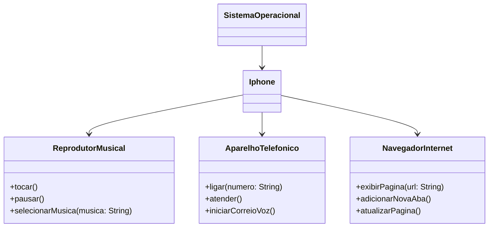

# Desafio Modelando o iPhone com UML: Funções de Músicas, Chamadas e Internet

Desafio:
Com base no vídeo de lançamento do iPhone conforme link abaixo, elabore em uma ferramenta de UML de sua preferência. A diagramação das classes e interfaces com a proposta de representar os papéis do iPhone de: Reprodutor Musical, Aparelho Telefônico e Navegador na Internet. Em seguida crie as classes e interfaces no formato de arquivos .java

[Lançamento iPhone 2017](https://www.youtube.com/watch?v=9ou608QQRq8)

## Diagrama UML

O diagrama UML como sugerido foi criado utilizando a sintaxe [Mermaid](https://mermaid.js.org/), uma alternativa open-source e que é compatível com arquivos Markdown.

